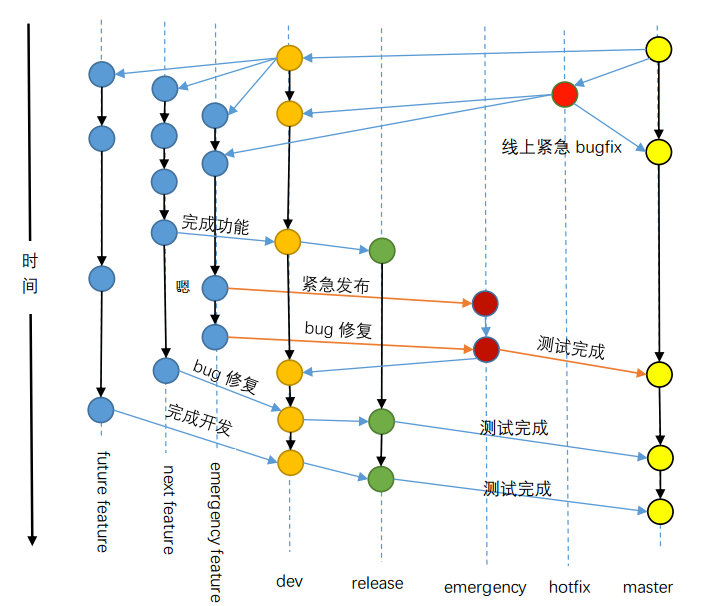
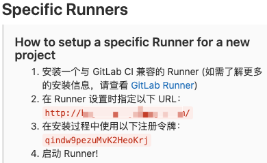
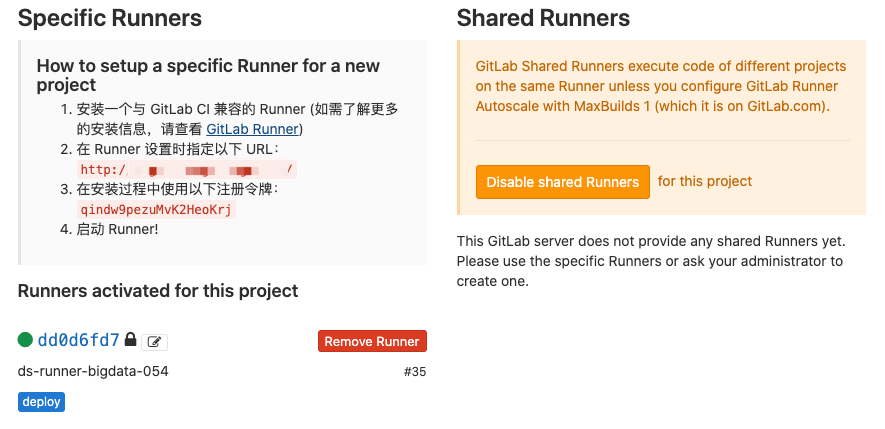
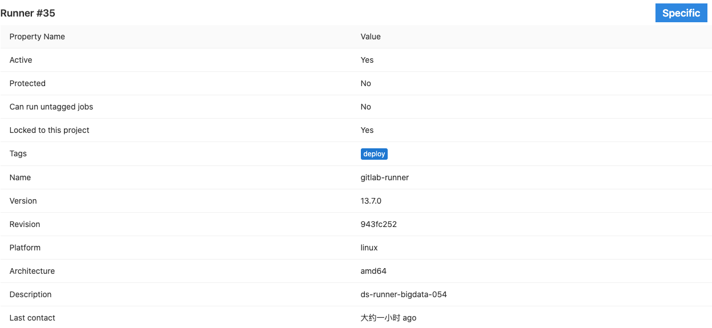
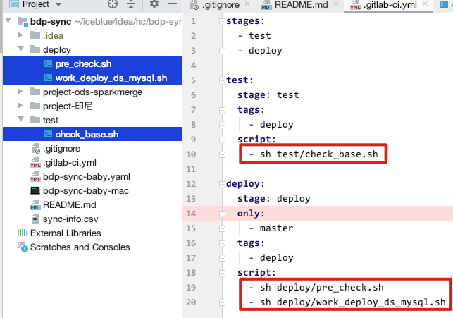
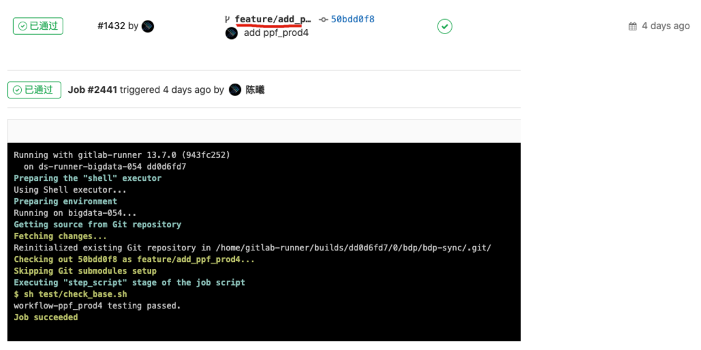
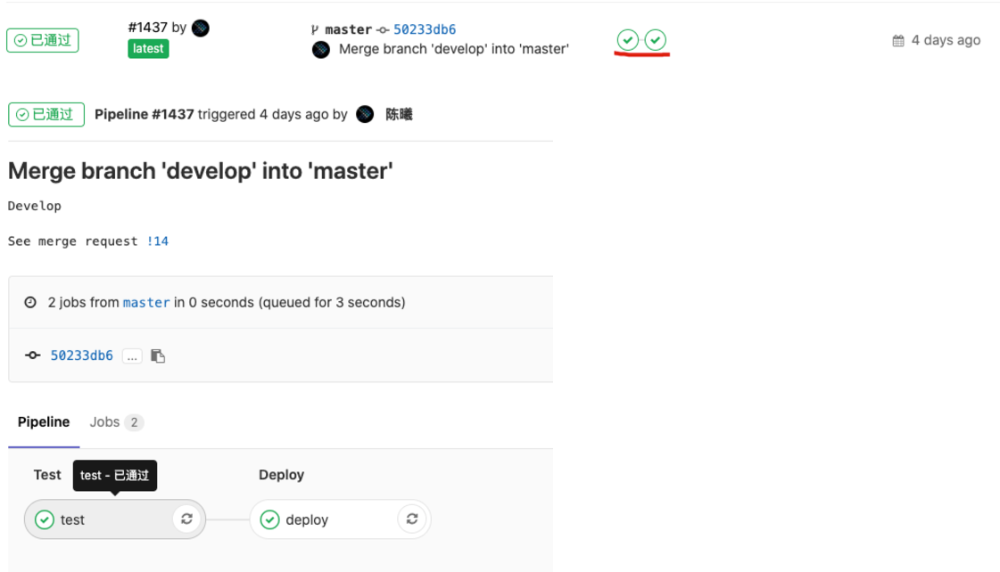
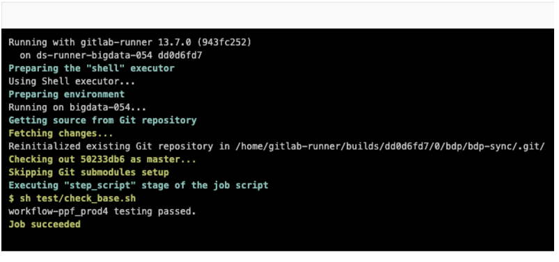
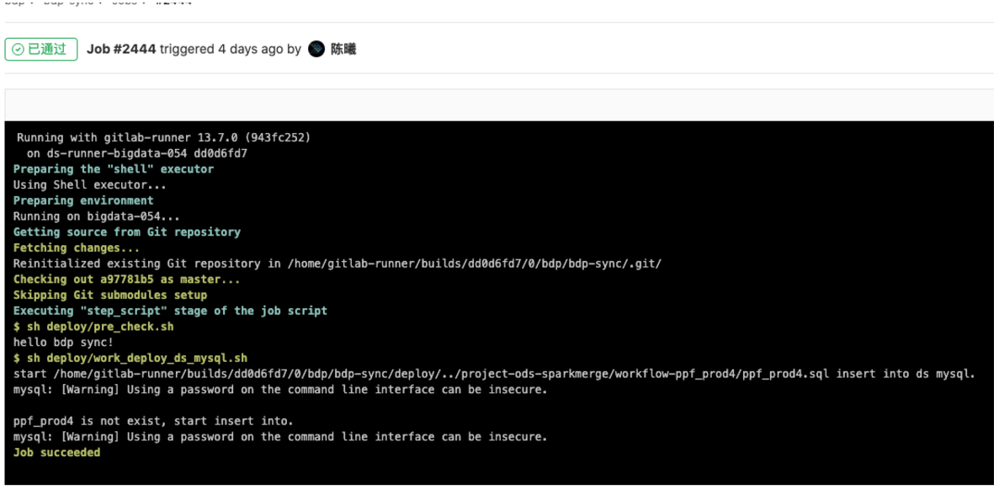

# Git使用教程

## Git 协作开发流程

参考 https://www.cnblogs.com/xiaoqi/p/gitlab-flow.html

当前git是大部分开发团队的首选版本管理工具，一个好的流程规范可以让大家有效地合作，像流水线一样有条不紊地进行团队协作。

业界包含三种flow：

- Git flow
- Github flow
- Gitlab flow

**git flow**


然后，我们老的git规范是参考git flow实现的。



综合考虑了开发、测试、新功能开发、临时需求、热修复，理想很丰满，现实很骨干，这一套运行起来实在是太复杂了。那么如何精简流程呢？

我们来看业界的做法，首先是github flow。

**github flow**

Github flow 是Git flow的简化版，专门配合”持续发布”。它是 Github.com 使用的工作流程。


## Git 基本常用命令

- git clone  克隆项目, 比如 `git clone git@github.com:apache/hadoop.git`;
- git push   推送代码, 比如 `git push origin master`;
- git add    将修改的内容添加到项目中, 比如 `git add src/java/Hello.java` 也可以在当前目录下执行 `git add .` 这样会添加所有内容;
- git commit 将项目提交到本地的代码库, 比如 `git commit -m 'init'`;
- git checkout 切换分支, 比如 `git checkout develop`;
- git pull  获得远端代码库的更新, 比如 `git pull origin develop`;
- git log   查看本地代码库的日志,直接执行即可查看;


## Git CI/CD 使用

### runner 安装注册

git的CI/CD是需要通过runner来执行的,runner是一个安装在任意服务器上的agent程序.

**下载地址**

```
https://gitlab-runner-downloads.s3.amazonaws.com/latest/index.html
```

```
https://gitlab-runner-downloads.s3.amazonaws.com/latest/rpm/gitlab-runner_amd64.rpm
```

**安装**

```
[root@bigdata-054 bak]# rpm -ivh gitlab-runner_amd64.rpm
warning: gitlab-runner_amd64.rpm: Header V4 RSA/SHA512 Signature, key ID 880721d4: NOKEY
Preparing...                          ################################# [100%]
Updating / installing...
   1:gitlab-runner-13.7.0-1           ################################# [100%]
GitLab Runner: creating gitlab-runner...
Runtime platform                                    arch=amd64 os=linux pid=59644 revision=943fc252 version=13.7.0
gitlab-runner: Service is not running.
Runtime platform                                    arch=amd64 os=linux pid=59694 revision=943fc252 version=13.7.0
gitlab-ci-multi-runner: Service is not running.
Runtime platform                                    arch=amd64 os=linux pid=59815 revision=943fc252 version=13.7.0
Runtime platform                                    arch=amd64 os=linux pid=60087 revision=943fc252 version=13.7.0
```

**注册**

注册的时候需要填写对应项目的 `settings` -> `ci/cd` -> `Runners settings` -> `Specific Runners`

URL 和 令牌，详情见下图



注册时会出现如下问题

**错误1**

```
ERROR: Registering runner... failed                 runner=qindw9pe status=couldn't execute POST against http://hcgit.hengchang6.com/api/v4/runners: Post http://hcgit.hengchang6.com/api/v4/runners: dial tcp: lookup hcgit.hengchang6.com on 192.168.20.1:53: read udp 10.100.12.100:22102->192.168.20.1:53: i/o timeout
PANIC: Failed to register the runner. You may be having network problems. 
```

dns配置有问题，配置一个正确的dns

**错误2**

```
ERROR: Registering runner... error                  runner=qindw9pe status=parse http://hcgit.hengchang6.com/api/v4/: net/url: invalid control character in URL
PANIC: Failed to register the runner. You may be having network problems. 
```

`Enter the GitLab instance URL (for example, https://gitlab.com/):` 这一步里面的url写的有问题

**错误3**

```
ERROR: Registering runner... error                  runner=qindw9pe status=only http or https scheme supported
PANIC: Failed to register the runner. You may be having network problems.
```

`Enter the GitLab instance URL (for example, https://gitlab.com/):` 这一步前面只能是http或者https

**最后正确的注册效果**

```
[root@bigdata-054 ~]# gitlab-ci-multi-runner register
Runtime platform                                    arch=amd64 os=linux pid=60607 revision=943fc252 version=13.7.0
Running in system-mode.

Enter the GitLab instance URL (for example, https://gitlab.com/):
http://hcgit.hengchang6.com/
Enter the registration token:
qindw9pezuMvK2HeoKrj
Enter a description for the runner:
[bigdata-054]: ds-runner-bigdata-054
Enter tags for the runner (comma-separated):
deploy
Registering runner... succeeded                     runner=qindw9pe
Enter an executor: ssh, docker+machine, kubernetes, custom, docker, docker-ssh, parallels, shell, virtualbox, docker-ssh+machine:
shell
Runner registered successfully. Feel free to start it, but if it's running already the config should be automatically reloaded! 
```

注册成功会在页面上显示



runner详情如下



注意 `tags` 在编写 `CI/CD 流程文件` 的时候会要用到.

### CI/CD 测试

这里是使用shell来进行测试演示.

**准备runner环境**

在对应runner机器中 创建目录和测试文件

切换用户

```
su gitlab-runner
```

创建目录

```
mkdir -p ~/.local/bin && cd ~/.local/bin
```

创建测试文件 `vim hello.sh`

```
#!/bin/bash

echo "hello git runner!"
```

配置环境变量 `vim /etc/profile`

```
export PATH=$HOME/.local/bin:$PATH 
```

创建ssh key

```
ssh-keygen -t rsa
```

将id_rsa.pub  添加到git的ssh key中

**编写配置文件**

在工程的根目录下 编写 `.gitlab-ci.yml` 配置文件。这是gitlab的官方规范，以这个文件为CI/CD的基础

```yaml
stages:             # ci/ci 有哪些阶段，名字自定义
  - test            # 测试阶段
  - deploy          # 部署阶段

test:                           # 测试阶段
  stage: test                   # 阶段名
  tags:                         # 对应在哪个 git runner 上执行
    - deploy
  script:                       # 执行什么样的script，这里我选的shell，可以直接执行工程里面的脚本
    - sh test/check_base.sh

deploy:                         # 部署阶段
  stage: deploy
  only:                         # 只在哪个分支上进行，如果不写的话是所有分支都会进行
    - master
  tags:                         # 对应在哪个 git runner 上执行
    - deploy
  script:                       # 执行什么样的script，可以写多个，目前测试是由上往下顺序执行
    - sh deploy/pre_check.sh
    - sh deploy/work_deploy_ds_mysql.sh
```

script可以直接执行工程里面的脚本，与工程内的对应关系如下



**测试结果**

提交代码会自动触发我们前面定义个 `test` ，比如我们提了个新的feature分支



往主分支合并的时候会触发 test 和 deploy







