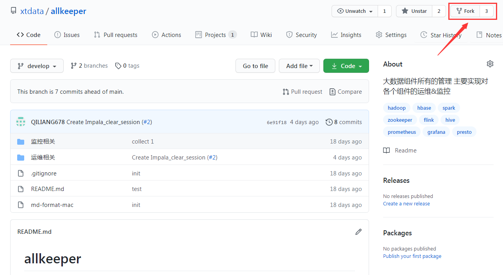
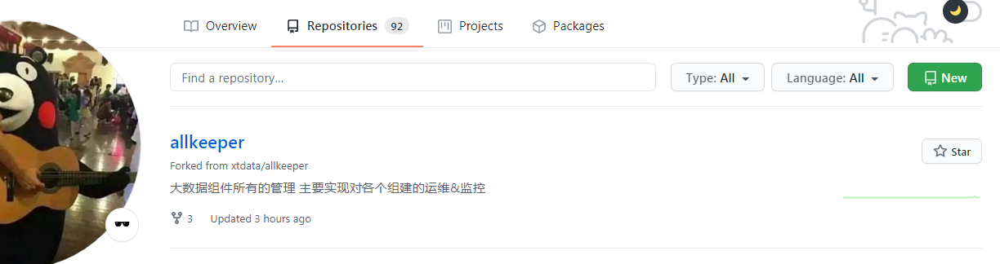
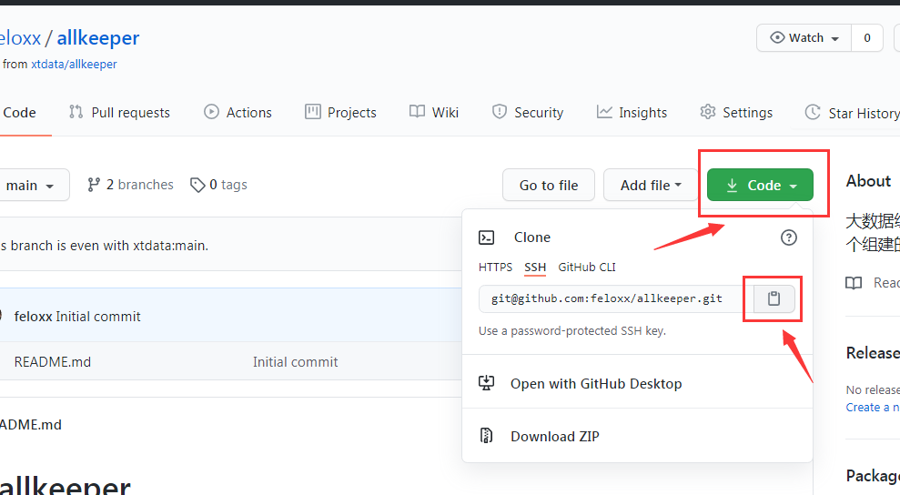
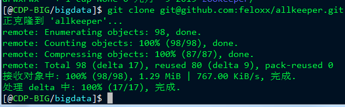
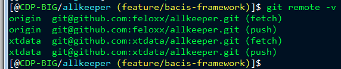
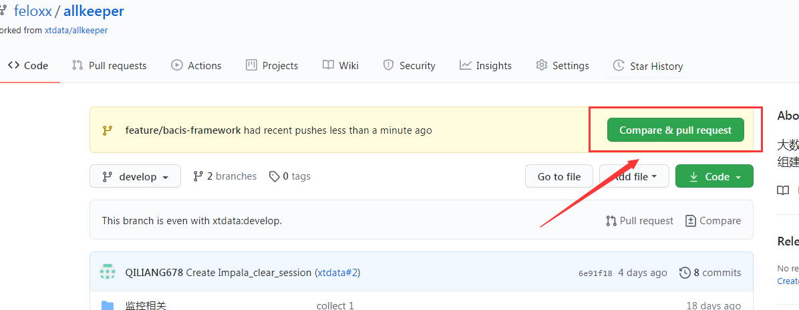

# PR流程和注意事项

[返回首页](../README.md)

---

## PR是什么

`P` `R` 是 `Pull Request` 的首字母缩写。是一种协作方式，常在软件开发中出现。

简单的理解就是一个 `请求（request）` 它的目的就是要别人 `拉取（pull）`你的东西，你的东西可以是代码也可以是文档，总之是你们约定之间协作的东西。

在git中这个一般泛指 `代码` 和 `文档`。

别人拉取你的代码或文档目的是什么呢？目的是为了将你的代码和文档合并到开发路线的相关分支中。

关于分支、Git开发、请参考[官方文档](https://docs.github.com/cn/free-pro-team@latest/github/getting-started-with-github/quickstart)

## PR流程介绍

### 第一步 fork 项目

在项目首页点击 `fork` 按钮即可，如下图所示：



点击后相当于把项目复制了一份到自己的github中。

在自己的 `Repositories` 中可以看到刚才fork的项目。



### 第一又二分之一步 克隆代码

fork完成之后，我们需要将代码下载到本机中，方便进行开发，行业黑话叫克隆 `clone`。

在自己的github中进入到刚才fork的项目页面，复制克隆代码的地址。



然后定位到你的工作目录，然后执行克隆，效果如下图。



### 第二步 添加 remote

git的 `remote` 概念，请参考 [官方文档](https://docs.github.com/cn/free-pro-team@latest/github/using-git/adding-a-remote)

例子如下

```
git remote add xtdata git@github.com:xtdata/allkeeper.git
```

添加完成后，我们可以执行 `git remote -v` 查看有哪些远程地址：



### 第三步 开发

在开发代码或文档之前，我们先添加 `user` 信息，这一步主要是方便在github中用户与代码能对应上。

修改 `.git/config` 文件中，添加如下内容，name可以随意写，email部分必须要与你的github邮箱能够对应上。

```
[user]
        name = chendapao
        email = feloxx@163.com
```

这时候我们可以开始开发了。

不过开发之前，我们需要看看上有代码是否有更新。

获取上游更新。

```
git fetch xtdata
```

将上游更新，合并到自己的开发分支。

```
git pull xtdata develop
```

创建自己的开发分支 进行这一次的开发。

```
git checkout -b feature/bacis-framework
```

### 第四步 提交 pull request

自己检查好代码或文档后，先提交到自己的仓库。命令如下：

注意提交的简介请用一句简单的英文描述。

```
git add . ; git commit -m 'add the document infrastructure framework'; git push origin feature/bacis-framework
```

然后在自己的github页面上点击向上游分支发起 `pull request`



等待其他人review，此时中间会有问题出现，提交者需要自己去解决。解决后没问题review通过会自动进行代码合并。此时行业黑话叫 `merge`。

---

[返回首页](../README.md)