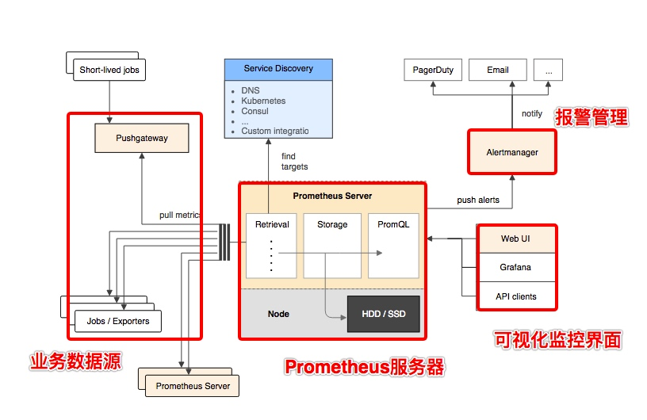

# prometheus-快速入门

## 架构图

## 角色介绍

- Prometheus 服务器
Prometheus Server 是 Prometheus组件中的核心部分，负责实现对监控数据的获取，存储以及查询。

- NodeExporter 业务数据源
业务数据源通过 Pull/Push 两种方式推送数据到 Prometheus Server。

- AlertManager 报警管理器
Prometheus 通过配置报警规则，如果符合报警规则，那么就将报警推送到 AlertManager，由其进行报警处理。

- 可视化监控界面
Prometheus 收集到数据之后，由 WebUI 界面进行可视化图标展示。目前我们可以通过自定义的 API 客户端进行调用数据展示，也可以直接使用 Grafana 解决方案来展示。

简单地说，Prometheus 的实现架构也并不复杂。其实就是收集数据、处理数据、可视化展示，再进行数据分析进行报警处理。 但其珍贵之处在于提供了一整套可行的解决方案，并且形成了一整个生态，能够极大地降低我们的研发成本。

## 快速入门

### 安装prometheus 

在这个地址 https://prometheus.io/download/ 下载prometheus

我是linux的，所以下载 https://github.com/prometheus/prometheus/releases/download/v2.23.0/prometheus-2.23.0.linux-amd64.tar.gz

TODO 先打样，后面再详细

